# Shell AI Go Implementation - User Interaction Flow

```mermaid
graph TB
    %% User Entry Points
    User[👤 User] --> CLI{Command Line Interface}
    CLI --> Ask["shell-ai ask question"]
    CLI --> Interactive["shell-ai interactive"]
    CLI --> Setup["shell-ai setup"]
    CLI --> Test["shell-ai test"]
    
    %% One-shot Query Flow
    Ask --> ContextGather[Context Gatherer]
    ContextGather --> SystemInfo["System Info<br/>OS, User, Hostname"]
    ContextGather --> WorkingDir["Working Directory"]
    ContextGather --> Environment["Environment Variables<br/>Filtered"]
    ContextGather --> ShellHistory["Shell History<br/>via Atuin"]
    ContextGather --> TmuxPanes["Tmux Pane Content<br/>if in tmux"]
    
    %% Context Processing
    SystemInfo --> ContextData[Context Data]
    WorkingDir --> ContextData
    Environment --> ContextData
    ShellHistory --> ContextData
    TmuxPanes --> ContextData
    
    %% AI Processing
    ContextData --> AIManager["AI Manager"]
    AIManager --> ProviderSelection["Provider Selection<br/>OpenAI, Anthropic, Google, Ollama"]
    ProviderSelection --> AICall["AI API Call"]
    AICall --> Response["AI Response"]
    Response --> User
    
    %% Interactive Session Flow
    Interactive --> SessionManager["Session Manager"]
    SessionManager --> ConversationID["Generate Conversation ID"]
    ConversationID --> PersistentStorage[("SQLite Database<br/>conversations.db")]
    
    %% Context Management in Interactive Mode
    SessionManager --> ContextManager["Context Manager"]
    ContextManager --> ContextLimits["Context Limits<br/>Max Tokens: 8000<br/>Max Messages: 20<br/>Max Context Size: 50000"]
    ContextManager --> TruncationCheck{"Context Size Check"}
    TruncationCheck -->|Within Limits| ProcessContext["Process Context"]
    TruncationCheck -->|Exceeds Limits| TruncateContext["Truncate Context<br/>Keep Initial Messages: 3<br/>Smart Truncation Strategy"]
    TruncateContext --> ProcessContext
    ProcessContext --> AIManager
    
    %% Data Storage Architecture
    subgraph "Data Storage Layer"
        PersistentStorage --> ConversationsTable[("conversations table")]
        PersistentStorage --> MessagesTable[("messages table")]
        PersistentStorage --> ConversationSummariesTable[("conversation_summaries table")]
        
        ConfigFile[("config.yaml<br/>~/.config/shell-ai/")] --> ProviderConfig["Provider Configuration<br/>API Keys, Models, Settings"]
        ConfigFile --> UserSettings["User Settings<br/>Max Tokens, Max Messages<br/>Context Limits, TTL"]
    end
    
    %% Context Expiration and Cleanup
    subgraph "Context Lifecycle Management"
        ContextManager --> TTLManager["TTL Manager<br/>Conversation TTL: 24h"]
        TTLManager --> CleanupScheduler["Cleanup Scheduler<br/>Every 24 hours"]
        CleanupScheduler --> ExpiredConversations["Expired Conversations<br/>Older than TTL"]
        ExpiredConversations --> DeleteOldData["Delete Old Data<br/>Free up storage"]
        
        ContextManager --> SmartTruncation["Smart Truncation<br/>Keep recent messages<br/>Preserve important context"]
        SmartTruncation --> TruncatedContext["Truncated Context<br/>Within token limits"]
    end
    
    %% Interactive Session Commands
    subgraph "Interactive Session Commands"
        SessionManager --> UserInput["User Input Loop"]
        UserInput --> SpecialCommands{"Special Commands?"}
        SpecialCommands -->|"/context"| ShowContext["Show Current Context"]
        SpecialCommands -->|"/send"| SendToPane["Send to Tmux Pane"]
        SpecialCommands -->|"/clear"| ClearConversation["Clear Conversation"]
        SpecialCommands -->|"/stats"| ShowStats["Show Context Stats"]
        SpecialCommands -->|"/quit"| ExitSession["Exit Session"]
        SpecialCommands -->|Regular Query| AIManager
    end
    
    %% Tmux Integration
    SendToPane --> TmuxClient["Tmux Client"]
    TmuxClient --> PaneSelector["Pane Selector<br/>Interactive Navigation"]
    PaneSelector --> SendCommands["Send Commands to Pane"]
    
    %% Configuration Management
    Setup --> ConfigManager["Config Manager"]
    ConfigManager --> ProviderSetup["Provider Setup<br/>API Keys, Models"]
    ConfigManager --> SettingsSetup["Settings Setup<br/>Context Limits, TTL"]
    ConfigManager --> SaveConfig["Save to config.yaml"]
    
    %% Testing
    Test --> ProviderTest["Provider Connection Test"]
    ProviderTest --> TestResults["Test Results"]
    
    %% Styling
    classDef userNode fill:#e1f5fe,stroke:#01579b,stroke-width:2px
    classDef storageNode fill:#f3e5f5,stroke:#4a148c,stroke-width:2px
    classDef processNode fill:#e8f5e8,stroke:#1b5e20,stroke-width:2px
    classDef aiNode fill:#fff3e0,stroke:#e65100,stroke-width:2px
    classDef contextNode fill:#fce4ec,stroke:#880e4f,stroke-width:2px
    
    class User userNode
    class PersistentStorage,ConfigFile,ConversationsTable,MessagesTable,ConversationSummariesTable storageNode
    class ContextGather,SystemInfo,WorkingDir,Environment,ShellHistory,TmuxPanes,ContextData processNode
    class AIManager,ProviderSelection,AICall,Response aiNode
    class ContextManager,ContextLimits,TruncationCheck,ProcessContext,TTLManager,CleanupScheduler contextNode
```

## Key Features Illustrated:

### 🔄 **Context Management**
- **Smart Truncation**: Keeps recent messages while preserving important context
- **TTL Management**: Automatic cleanup of conversations older than 24 hours
- **Context Limits**: Configurable token, message, and size limits

### 💾 **Data Storage**
- **SQLite Database**: Persistent storage for conversations and messages
- **Configuration**: YAML-based config for providers and settings
- **Automatic Cleanup**: Scheduled removal of expired data

### 🎯 **User Interactions**
- **One-shot Queries**: Direct AI responses with context
- **Interactive Sessions**: Persistent conversations with memory
- **Tmux Integration**: Send commands to specific panes
- **Configuration**: Easy setup of AI providers

### ⚡ **Performance Features**
- **Context Optimization**: Smart truncation to stay within limits
- **Storage Efficiency**: Automatic cleanup of old data
- **Concurrent Access**: WAL mode for database performance
